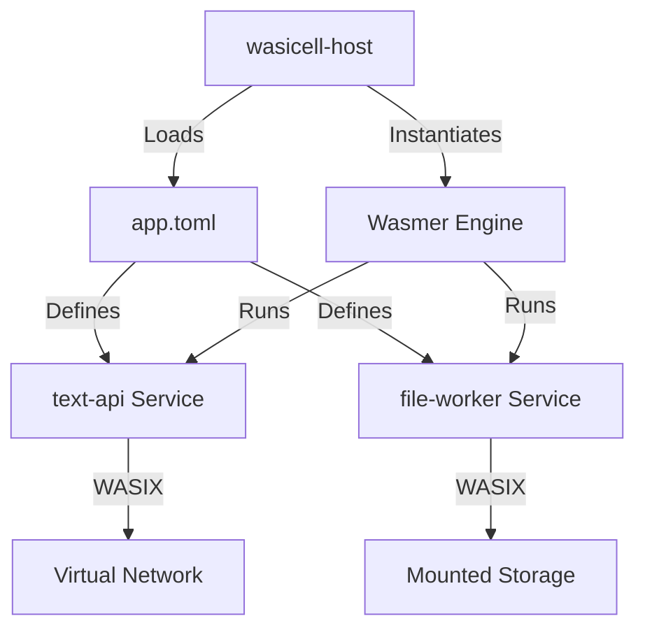

# wasicell-edge-lab 🧪

A miniature WebAssembly edge runtime and orchestrator built in Rust using **Wasmer** and **WASIX**.

This project demonstrates the power of WebAssembly as a lightweight, secure alternative to traditional containers (like Docker). It includes a host runtime that orchestrates multiple services from a manifest, providing sandboxed networking, storage mounts, and lifecycle management.

## 🚀 Key Features

- **Wasmer-Powered Runtime**: Uses the `wasmer-wasix` engine for high-performance, sandboxed execution.
- **WASIX Networking**: Full support for socket-based services (TCP/HTTP) within the Wasm sandbox.
- **Storage Orchestration**: Capability-based filesystem mounts, exposing specific host directories to guests.
- **Multi-Service Manifest**: Run entire applications defined in a single `app.toml`.
- **Comprehensive Benchmarks**: Built-in harness to compare Wasm vs Native vs Docker.

## 🏗️ Project Architecture



- **`crates/wasicell-host`**: The core Rust supervisor.
- **`crates/wasicell-common`**: Shared types and manifest parsing.
- **`crates/wasicell-bench`**: Automated performance comparison tool.
- **`guests/text-api`**: Networking demo (Rust/WASIX).
- **`guests/file-worker`**: Storage demo (Rust/WASIX).

## 📊 Performance at a Glance

| Metric | Native Rust | Docker (Debian) | **Wasicell (Wasm)** |
| :--- | :--- | :--- | :--- |
| **Package Size** | 4.33 MB | 79.4 MB | **1.07 MB** |
| **Cold Start** | ~0.8 ms | ~1.5 s | **~710 ms** |
| **Isolation** | None | Kernel-level | **Strong Sandbox** |

## 🛠️ Quick Start

### Prerequisites
- [Rust](https://rustup.rs/) (Nightly recommended)
- [Wasmer CLI](https://wasmer.io/)
- `cargo-wasix` (`cargo install cargo-wasix`)

### Build and Run
1. **Build all guests**:
   ```bash
   cd guests/text-api && cargo wasix build
   cd ../file-worker && cargo wasix build
   ```
2. **Run the orchestrator**:
   ```bash
   cargo run --package wasicell-host -- run examples/app.toml
   ```
3. **Test the services**:
   - `text-api`: `echo "hello" | nc 127.0.0.1 8787`
   - `file-worker`: Check `examples/data/output.txt`

## 🧪 Benchmarking
To run the comparative performance suite:
```bash
cargo run --package wasicell-bench
```
See the full [Performance Report](./performance_report.md) for details.

## 📜 License
MIT
